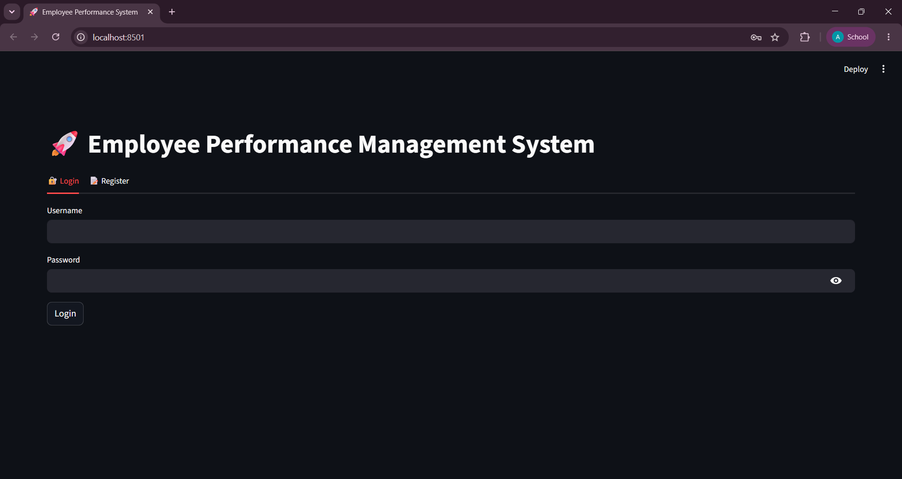
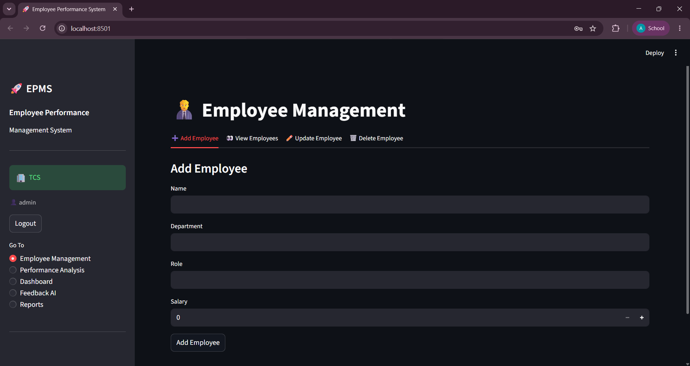
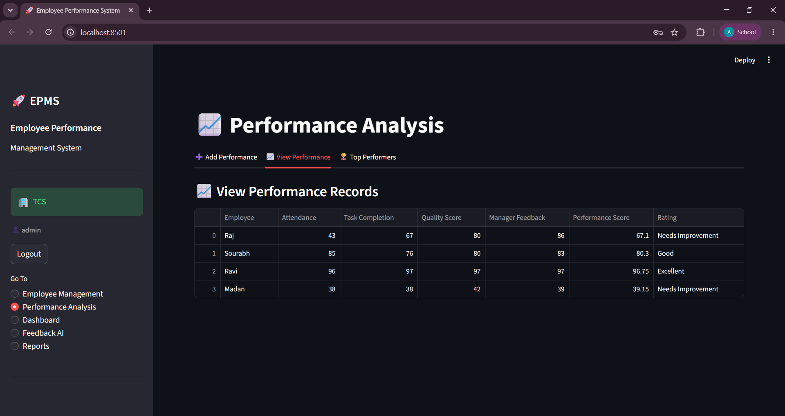
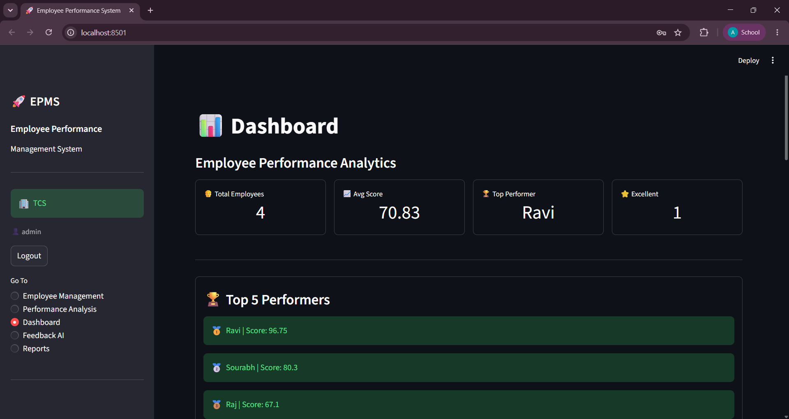
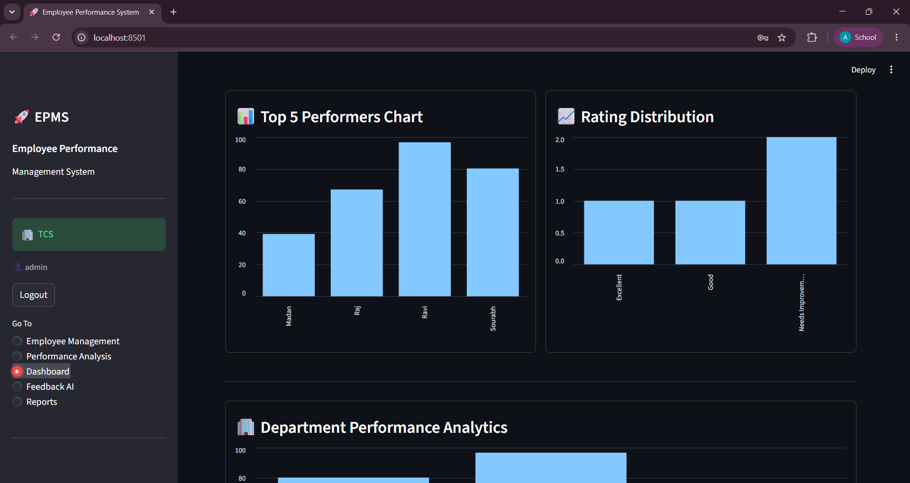
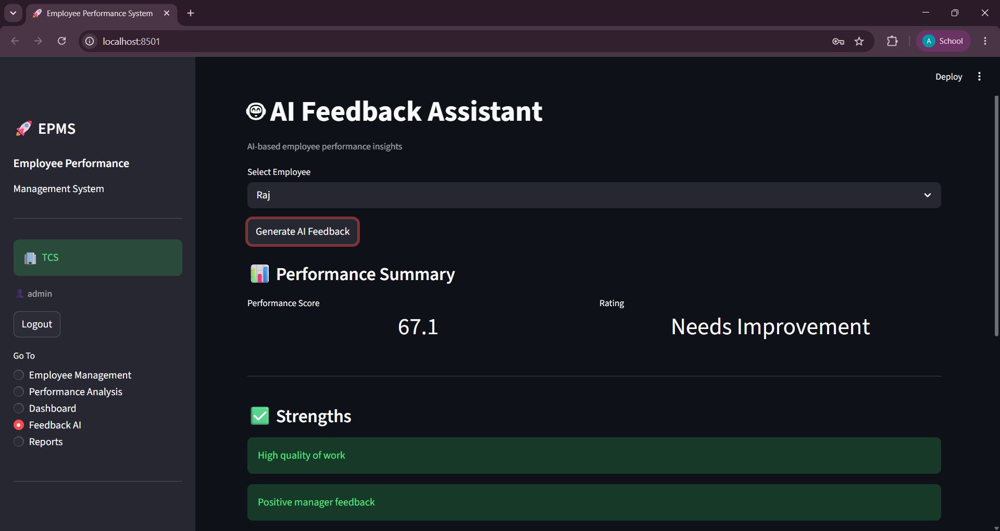
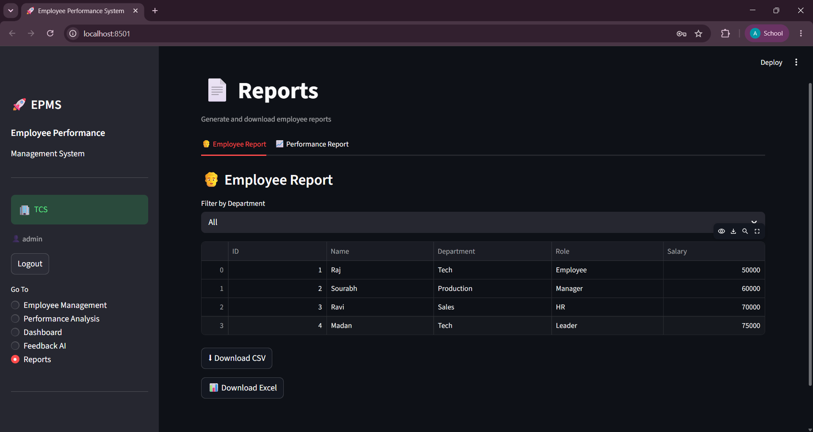

# 🚀 Employee Performance Management System (EPMS)

Employee Performance Management System (EPMS) built with Python, Streamlit, and SQLite.
Features employee management, performance tracking, AI feedback generation, analytics dashboard, reporting, and multi-company support.

---

## 📌 Features

### 🔐 Authentication

* Company Registration
* Secure Login System
* Multi-Company Support

### 👨‍💼 Employee Management

* Add Employees
* View Employees
* Update Employee Details
* Delete Employees
* Employee Search

### 📈 Performance Analysis

* Record Employee Performance
* Automatic Performance Score Calculation
* Employee Ratings
* Top Performer Tracking

### 📊 Dashboard Analytics

* Total Employees
* Average Performance Score
* Excellent Employee Count
* Top Performer
* Department-wise Analytics
* Performance Charts

### 🤖 AI Feedback Assistant

* Performance-based Feedback
* Strength Analysis
* Improvement Suggestions
* Recommendations for Employees

### 📄 Reports

* Employee Report Generation
* Performance Report Generation
* CSV Export
* Excel Export

---

## 🏢 Multi-Tenant Architecture

Each company has its own:

* Employees
* Performance Records
* Dashboard Analytics
* Reports

Data is completely isolated between companies.

---

## 🛠️ Tech Stack

* Python
* Streamlit
* SQLite
* Pandas
* OpenPyXL

---

## 📂 Project Structure

Employee_Performance_Management_System/

├── app.py

├── database/

│ └── db.py

├── modules/

│ ├── auth.py

│ ├── employee.py

│ ├── performance.py

│ └── feedback.py

├── views/

│ ├── employee_management.py

│ ├── performance_analysis.py

│ ├── dashboard.py

│ ├── feedback_ai.py

│ └── reports.py

└── employees.db

---

## 📷 Demo Screenshot
Here is a preview of the Employee-Performance-Management-System:

---

## 🚀 Live Demo

https://employee-performance-management-system-xa2zfebcwpbistjc3txvuk.streamlit.app/

---

## ▶️ Installation

1. Clone the repository

git clone https://github.com/aryankumar-931/Employee-Performance-Management-System.git

2. Install dependencies

pip install -r requirements.txt

3. Run the application

streamlit run app.py

---

## 👨‍💻 Author

Aryan Kumar Shasana

---

## ⭐ Future Enhancements

* Role-Based Access Control
* Cloud Database Integration
* Email Notifications
* Advanced AI Insights
* Performance Trends Analysis
